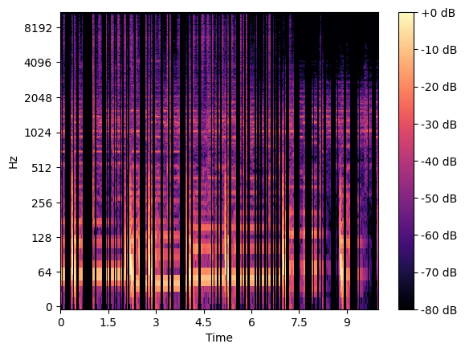

# Sound Experiments

This contains code for doing operations on sound files.

## Requirements

The requirements to run this project are in `requirements.txt`. To install, run `$ pip3 install -r requirements.txt`.

## Sound Operations

Several operations are done on sound files, which are found defined as Python functions in the main notebook. These operations are done by first performing a fast fourier transform on the file, using `librosa`'s `stft` function.

For reference on the following operations, the following spectograph is of the 10 second sample of "No Role Modelz" that the following operations were done on.


### Removing Weak Frequencies

All frequencies weaker than the average freqeuncy for the sample are removed.


### Removing Percussion

Attempts to remove percussion by finding the times of the song with a higher frequency sum than average.



### Filter Extreme Sounds

Removes frequencies outside given bounds.


### Keep "Strong" Notes

Keeps tones who are louder than preceding tone of the same frequency.


### Find Notes

Finds "notes," which are indicated by a tone having a significant entrance and significant exit.


### Pipeline

A simple pipeline is implemented where the user can put in any combination of functions and run a song through it. 

For example, the below spectograph is generated with:

```
Pipeline:
├─ clean_notes, args: (2.0, 1.0)
├─ filter_extreme, args: 40 200
└─ remove_weak_freqs
```


## Conversion to Pitches

Using a generated sound file from the pipeline, or just a plain sound file, it is attempted to generate pitches from the song using Tensorflow's `SPICE` model. However, the attempt was not very successful, producing nonsense.

## License

This software is released under the MIT License.